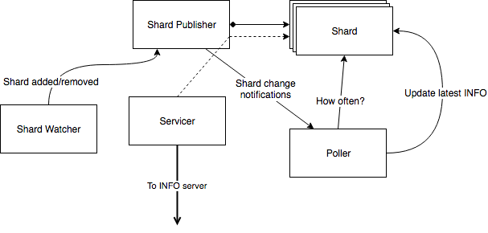

# Redis Info Provider
A Python framework for querying, caching, and serving to consumers info for an arbitrary number of redis-server
instances (result of executing `INFO all` command).

## Description
Got a bunch of Redis instances you want clients to be able to query `INFO` for, but don't want them running commands
directly on your instances? This is the module for you!

Feature highlights:

* Concurrent, single-threaded architecture leveraging [gevents](http://www.gevent.org).
* Dynamically-adjusted per-instance polling intervals based on instance activity level. (Timing range is user-tweakable.)
* Flexible API for info querying.
* Compatible with both Python 2 and Python 3.

## Getting Started

### Installing

> This module supports Python 2/3 and has been tested with Python >= 2.7.14 and Python >= 3.6.4.

Download or clone the library source, `cd` into the download location, and run:

```
python setup.py install
```

or:

```
pip install .
```

### Running the Tests

```
python setup.py test
```

## Usage Examples

The framework comes with sample client/server applications to demonstrate its use. They use Python's included
[xmlrpclib](https://docs.python.org/2/library/xmlrpclib.html) module and can be found in the `examples` directory:

```
examples/
  info_client.py
  info_server.py
```

Experiment with the example programs and browse through their code to get an idea of how the system is designed to be
used and its capabilities. A `--help` command-line flag is available for both to list their supported arguments.

## Architecture



### Shard Publisher

The central orchestrator component of the system. The shard publisher tracks the currently running shards in the system
and serves as the repository for live shard objects. It also provides subscribable notification services for new shards
being added to the system or live shards being removed from it.

### Shard

A class (`RedisShard`), instances of which represent tracked live shards. The shard object provides its *identifier* and
a way to obtain a working *connection* to that shard. It also stores the latest available *INFO* for the shard (once one
is available), as well as tracks that info's *age*. Lastly, it implements logic for determining how often the shard
should be polled for new info, based on the shard's activity level.

### Shard Watcher

The shard watcher is responsible for watching for new shards being added to the system, as well as live shards being
removed from it, and notifying the shard publisher accordingly. A default implementation (`LocalShardWatcher`) is
provided with the framework, which attempts to track all running instances of `redis-server` on the local machine;
however, this is meant for demonstration purposes only, and is not designed for production code.

> **The system is designed for you to plug in your own shard watcher that implements your application-specific logic.**

### Poller

The poller uses gevent-based concurrency to periodically poll all live shards for up-to-date info. The polling interval
is determined independently for each shard, based on the logic implemented in the `RedisShard` class.

### Servicer

Provides the API to be exposed by an appropriate server for querying the system.

Currently the servicer interface is written for usage with RPC modules such as
[xmlrpclib](https://docs.python.org/2/library/xmlrpclib.html) in mind, and this is what's used in the included example
server/client. However, writing an adapter wrapper to support a different kind of server interface (e.g.: gRPC, HTTP
REST) should be a relatively straightforward task.
